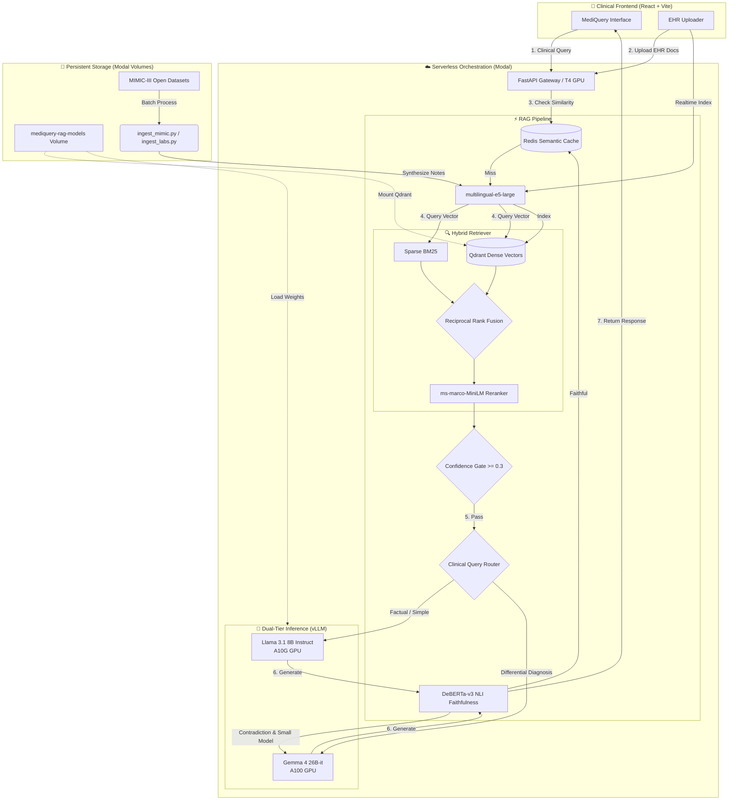
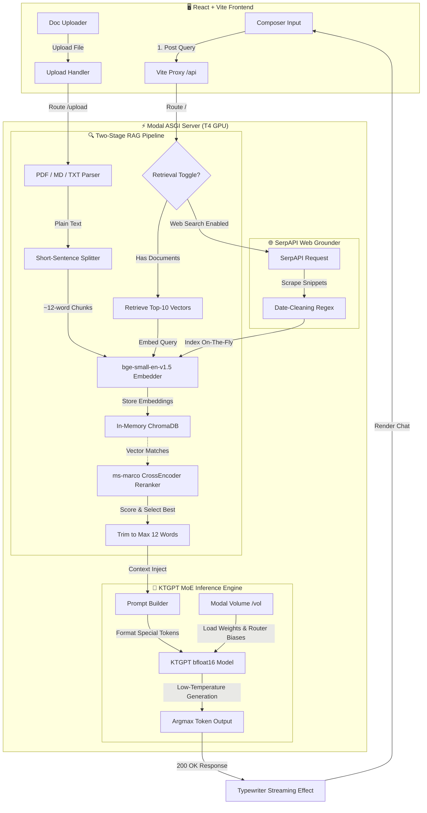

# 🏥 MediQuery — Clinical RAG Decision Support System

[](https://fastapi.tiangolo.com)
[](https://react.dev)
[](https://tailwindcss.com)
[](https://modal.com)
[](https://qdrant.tech)
[](https://pytorch.org)
[](https://vllm.ai)
[](https://redis.io)

> **MediQuery** is a production-grade, context-grounded clinical decision support system. Powered by a **cost-aware dual-model inference engine** (Gemma 4 26B + Llama 3.1 8B via vLLM), it combines **hybrid BM25 + dense vector retrieval**, **semantic query caching**, and **NLI faithfulness verification** to deliver fast, accurate, hallucination-resistant clinical analyses optimized for MIMIC-III Electronic Health Records (EHR).

---

## 🆚 Legacy → MediQuery: What Changed

| Capability | v1 (KTGPT MoE) | MediQuery (Production Clinical RAG) |
| :--- | :--- | :--- |
| **Inference Model** | Custom KTGPT MoE (T4) | Gemma 4 26B + Llama 3.1 8B via vLLM |
| **Embeddings** | `bge-small-en-v1.5` | `multilingual-e5-large` |
| **Chunking** | Fixed ~12-word splits | Semantic similarity breakpoints for medical notes |
| **Retrieval** | Dense only (ChromaDB) | Hybrid BM25 + Qdrant → RRF → Rerank |
| **Deduplication** | None | MinHash (Jaccard ≥ 0.8) |
| **Hallucination control** | Reranker score only | Clinical Confidence gate + NLI faithfulness |
| **Model routing** | Single model | Cost-aware: Factual ↔ Differential Diagnosis |
| **Query caching** | None | Redis semantic cache (cosine sim ≥ 0.95) |
| **Vector store** | In-memory ChromaDB | Qdrant (persisted Modal Volume) |

> The original v1 `server.py` is preserved as-is and can be restored in one line of `vite.config.ts`.

---

## ⚕️ Core Clinical Architecture



---

## 🧭 v1 Architecture (Legacy — server.py)

The original pipeline is preserved for reference:



---

## 🔥 Key Medical Features

#### 1. Semantic Clinical Chunking (`chunker.py`)
- Embeds every sentence from discharge summaries with `multilingual-e5-large`.
- Splits into new chunks at **similarity drop-off points** to preserve medical context blocks.
- **MinHash deduplication** removes near-duplicate notes before indexing.

#### 2. Hybrid Retrieval with RRF (`retriever.py`)
- **Dense:** `multilingual-e5-large` embeddings in **Qdrant** (persisted Modal Volume).
- **Sparse:** `rank_bm25` BM25Okapi for exact medical keyword matching.
- **RRF Fusion** (`k=60`): Merges ranked lists by position, reranked by `ms-marco-MiniLM-L-6-v2`.

#### 3. Hallucination Control for Patient Safety (`hallucination.py`)
- **Confidence gate:** If the top reranker score is `< 0.3`, the server refuses to answer rather than fabricating a diagnosis.
- **NLI verification:** `cross-encoder/nli-deberta-v3-base` classifies whether the generated response is *entailed*, *neutral*, or *contradicted* by the patient's chart.
- **Escalation:** If the fast model's response is contradicted, the request is automatically re-run through the bigger, safer model.

#### 4. Cost-Aware Clinical Routing (`router.py`)
- Routes queries based on length, complexity heuristics (`"differential diagnosis"`, `"comorbidities"`, `"interactions"`), and retrieval confidence.
- **Llama 3.1 8B** (A10G) → Simple factual lookups (e.g. "What was the patient's last glucose level?")
- **Gemma 4 26B** (A100) → Complex analyses or mandatory escalations for safety-critical queries ("code blue", "anaphylaxis").

#### 5. Redis Semantic Cache (`cache.py`)
- Embeds each query and computes cosine similarity against cached query embeddings.
- Similarity ≥ `0.95` → cache hit → instant response, zero inference cost.

---

## 📂 Project Directory Structure

```text
ktgpt_chat/
├── backend/
│   ├── rag_server.py         # [MediQuery] Main orchestrator — Modal app, FastAPI routes
│   ├── chunker.py            # [MediQuery] Semantic chunking + MinHash dedup
│   ├── retriever.py          # [MediQuery] Hybrid BM25 + Qdrant + RRF + rerank
│   ├── hallucination.py      # [MediQuery] Confidence gate + NLI faithfulness
│   ├── router.py             # [MediQuery] Cost-aware Llama ↔ Gemma routing
│   ├── cache.py              # [MediQuery] Redis semantic query cache
│   ├── models.py             # [MediQuery] Pydantic API schemas
│   ├── prompts.py            # [MediQuery] Llama 3.1 + Gemma 4 prompt formatters
│   ├── ingest_mimic.py       # [MediQuery] Job to ingest full NOTEEVENTS.csv
│   ├── ingest_labs.py        # [MediQuery] Job to ingest Kaggle subsets into synthetic notes
│   ├── download_weights.py   # [MediQuery] One-time Modal weight download script
│   └── server.py             # [v1] Original KTGPT MoE server (preserved)
├── frontend/
│   ├── src/
│   │   ├── components/chat/
│   │   │   ├── MessageBubble.tsx   # Model badge, confidence bar, risk badges
│   │   │   ├── Composer.tsx        # File upload, web search toggle
│   │   │   └── Welcome.tsx         # Greeting + clinical quick-start prompts
│   │   ├── pages/
│   │   │   └── Index.tsx       # Main chat page + API bridge
│   │   ├── lib/
│   │   │   ├── chatTypes.ts    # Message types (+ modelUsed, confidence, clinicalRisk)
│   │   │   ├── theme.tsx       # Dark/light theme
│   │   │   └── mockLlm.ts      # Typewriter streaming utility
│   │   ├── index.css           # Clinical design system & theme tokens
│   │   └── main.tsx            # React entry
│   ├── vite.config.ts          # Proxy → MediQuery rag_server (v1 URL commented)
│   └── package.json
├── pyproject.toml              # Python deps (MediQuery)
└── README.md
```

---

## 🔌 API Endpoint Specifications

### MediQuery — RAG Server (`rag_server.py`)

| Endpoint | Method | Description | Request | Response |
| :--- | :--- | :--- | :--- | :--- |
| `/` | `POST` | Full clinical RAG pipeline chat | `{question, context?, use_retrieval?, use_web_search?}` | `{response, source, model_used, confidence, faithful, cached, clinical_risk, cost_usd}` |
| `/upload` | `POST` | Index document (TXT/MD/PDF) | `Multipart: file` | `{filename, chunks, status, dedup_removed}` |
| `/stats` | `GET` | Index + cost statistics | — | `{documents, chunks, bm25_terms, cache_entries, total_cost_usd, queries_small, queries_big}` |
| `/clear` | `POST` | Clear all indices + cache | — | `{status: "cleared"}` |
| `/health` | `GET` | System health check | — | `{status, models_loaded, qdrant_connected, redis_connected}` |

---

## 🚀 Deployment & Installation Guide

### 🛠️ Backend — MediQuery RAG Server

#### Step 1: Pre-requisites
```bash
pip install modal
modal setup
```

#### Step 2: Create Modal Secrets
In your [Modal Secrets dashboard](https://modal.com/secrets):
| Secret Name | Key | Value |
| :--- | :--- | :--- |
| `hf-secret` | `HF_TOKEN` | HuggingFace token (needs Gemma 4 + Llama 3.1 access) |
| `serpapi` | `SERPAPI_KEY` | SerpAPI key for web search |
| `redis-secret` | `REDIS_URL` | Upstash Redis URL (`rediss://...`) |

#### Step 3: Download All Model Weights (one-time, ~45 min)
```bash
modal run backend/download_weights.py
```
Downloads to the `mediquery-rag-models` Modal Volume:
- `google/gemma-4-26B-A4B-it` — ~50 GB → A100 GPU
- `meta-llama/Llama-3.1-8B-Instruct` — ~16 GB → A10G GPU
- `intfloat/multilingual-e5-large` — ~560 MB (embeddings)
- `cross-encoder/ms-marco-MiniLM-L-6-v2` — ~67 MB (reranker)
- `cross-encoder/nli-deberta-v3-base` — ~180 MB (faithfulness)

#### Step 4: Deploy
```bash
# Test interactively
modal serve backend/rag_server.py

# Deploy permanently
modal deploy backend/rag_server.py
```

### 🛠️ Backend — v1 KTGPT (Legacy)
```bash
# Requires hf-secret + serpapi secrets
modal run backend/server.py
modal deploy backend/server.py
```

### 💻 Frontend Client (Vite + React)
```bash
cd frontend
npm install
npm run dev
```
Open `http://localhost:8080` and start chatting.

---

## 📂 MIMIC-III Data Ingestion

MediQuery is natively optimized for the **MIMIC-III Clinical Database**. Due to PhysioNet's strict Data Use Agreements (DUA), we do not bundle the `NOTEEVENTS.csv` (discharge summaries) in this repository.

### If you have the Open-Access Kaggle Subset:
If you are using the public [MIMIC-III Kaggle subset](https://www.kaggle.com/datasets/ihssanened/mimic-iii-clinical-databaseopen-access) which contains structured files, you can use our synthetic note generator:

1. Upload the files to your cloud volume:
```bash
modal volume put mediquery-rag-models patient.csv /
modal volume put mediquery-rag-models admissions.csv /
modal volume put mediquery-rag-models d_labitems.csv /
modal volume put mediquery-rag-models labevents.csv /
```

2. Run the ingestion job:
```bash
modal run backend/ingest_labs.py --limit 100
```

### If you have the full `NOTEEVENTS.csv` from PhysioNet:
1. Upload the CSV to your cloud volume:
```bash
modal volume put mediquery-rag-models NOTEEVENTS.csv /
```

2. Run the discharge summary ingestion job:
```bash
modal run backend/ingest_mimic.py --limit 100
```

---

## 🎨 Clinical Interface Features

| Feature | Description |
| :--- | :--- |
| **⚡ / 🧠 Model Badge** | Shows whether Llama 3.1 8B or Gemma 4 26B handled the query. |
| **🛡️ Clinical Risk Badge** | Shows NLI verification results (Evidence-Based, Verify Claims, Review Required). |
| **▓▓▒░ Confidence Bar** | Retrieval reranker confidence (mapped to Safe/Warning/Danger). |
| **💲 Cost Estimates** | Real-time tracking of simulated inference costs per query. |
| **📁 EHR Uploader** | Upload clinical PDFs, MDs, or TXTs for immediate patient-specific analysis. |
